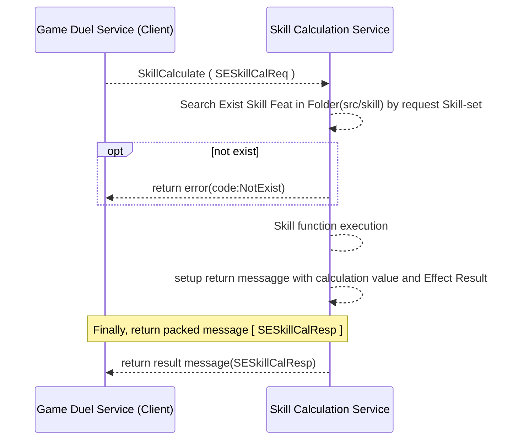
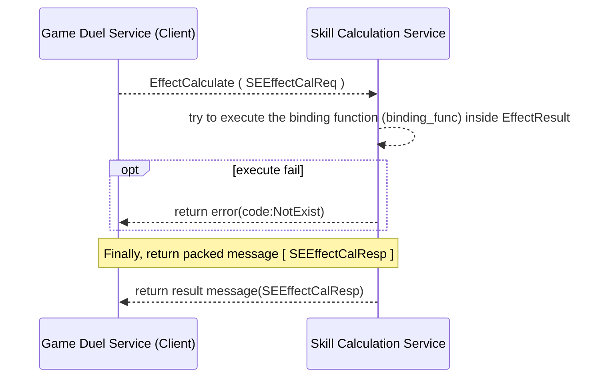
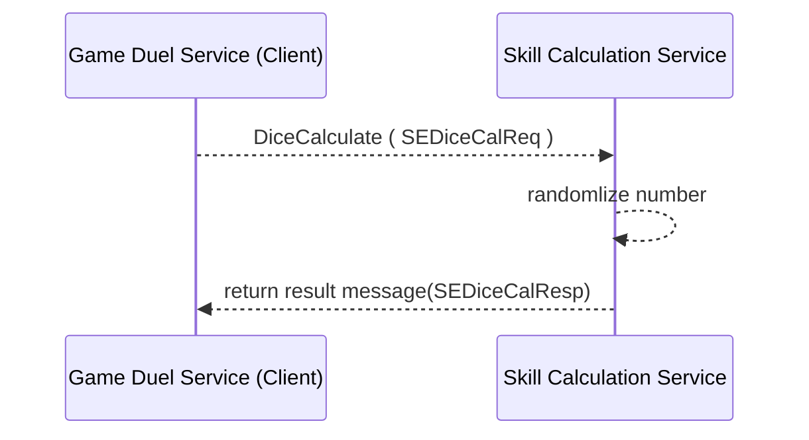

# Protocol Documentation

## Table of Contents

- [Protocol Documentation](#protocol-documentation)
  - [Table of Contents](#table-of-contents)
  - [service.proto](#serviceproto)
    - [SkillEffectService](#skilleffectservice)
      - [SkillInstCalc](#skillinstcalc)
      - [SkillCalculate](#skillcalculate)
        - [Workflow](#workflow)
      - [EffectCalculate](#effectcalculate)
        - [Workflow](#workflow-1)
      - [DiceCalculate](#dicecalculate)
        - [Workflow](#workflow-2)
  - [Scalar Value Types](#scalar-value-types)
  
- [Scalar Value Types](#scalar-value-types)

<a href="#top">Top</a>

## service.proto

### SkillEffectService
ANCHOR: service-func for SkillEffectService
SECTION: service.proto

| Method Name     | Request Type                               | Response Type                                | Description |
| --------------- | ------------------------------------------ | -------------------------------------------- | ----------- |
| SkillInstCalc   | [SESkillCalReq](#ULZProto.SESkillCalReq)   | [SESkillCalResp](#ULZProto.SESkillCalResp)   |             |
| SkillCalculate  | [SESkillCalReq](#ULZProto.SESkillCalReq)   | [SESkillCalResp](#ULZProto.SESkillCalResp)   |             |
| EffectCalculate | [SEEffectCalReq](#ULZProto.SEEffectCalReq) | [SEEffectCalResp](#ULZProto.SEEffectCalResp) |             |
| DiceCalculate   | [SEDiceCalReq](#ULZProto.SEDiceCalReq)     | [SEDiceCalResp](#ULZProto.SEDiceCalResp)     |             |

 
####  SkillInstCalc   
Request : [SESkillCalReq](#ULZProto.SESkillCalReq)
Response : [SESkillCalResp](#ULZProto.SESkillCalResp) 

DDP 

#### SkillCalculate  
Request : [SESkillCalReq](#ULZProto.SESkillCalReq)   
Response : [SESkillCalResp](#ULZProto.SESkillCalResp) 

##### Workflow

---
#### EffectCalculate 
Request : [SEEffectCalReq](#ULZProto.SEEffectCalReq) 
Response: [SEEffectCalResp](#ULZProto.SEEffectCalResp) 

Remark: not fully implement in current process

##### Workflow

#### DiceCalculate   
Request : [SEDiceCalReq](#ULZProto.SEDiceCalReq)     
Response : [SEDiceCalResp](#ULZProto.SEDiceCalResp)     

##### Workflow

## Scalar Value Types

| .proto Type                    | Notes                                                                                                                                           | C++    | Java       | Python      | Go      | C#         | PHP            | Ruby                           |
| ------------------------------ | ----------------------------------------------------------------------------------------------------------------------------------------------- | ------ | ---------- | ----------- | ------- | ---------- | -------------- | ------------------------------ |
| <a name="double" /> double     |                                                                                                                                                 | double | double     | float       | float64 | double     | float          | Float                          |
| <a name="float" /> float       |                                                                                                                                                 | float  | float      | float       | float32 | float      | float          | Float                          |
| <a name="int32" /> int32       | Uses variable-length encoding. Inefficient for encoding negative numbers – if your field is likely to have negative values, use sint32 instead. | int32  | int        | int         | int32   | int        | integer        | Bignum or Fixnum (as required) |
| <a name="int64" /> int64       | Uses variable-length encoding. Inefficient for encoding negative numbers – if your field is likely to have negative values, use sint64 instead. | int64  | long       | int/long    | int64   | long       | integer/string | Bignum                         |
| <a name="uint32" /> uint32     | Uses variable-length encoding.                                                                                                                  | uint32 | int        | int/long    | uint32  | uint       | integer        | Bignum or Fixnum (as required) |
| <a name="uint64" /> uint64     | Uses variable-length encoding.                                                                                                                  | uint64 | long       | int/long    | uint64  | ulong      | integer/string | Bignum or Fixnum (as required) |
| <a name="sint32" /> sint32     | Uses variable-length encoding. Signed int value. These more efficiently encode negative numbers than regular int32s.                            | int32  | int        | int         | int32   | int        | integer        | Bignum or Fixnum (as required) |
| <a name="sint64" /> sint64     | Uses variable-length encoding. Signed int value. These more efficiently encode negative numbers than regular int64s.                            | int64  | long       | int/long    | int64   | long       | integer/string | Bignum                         |
| <a name="fixed32" /> fixed32   | Always four bytes. More efficient than uint32 if values are often greater than 2^28.                                                            | uint32 | int        | int         | uint32  | uint       | integer        | Bignum or Fixnum (as required) |
| <a name="fixed64" /> fixed64   | Always eight bytes. More efficient than uint64 if values are often greater than 2^56.                                                           | uint64 | long       | int/long    | uint64  | ulong      | integer/string | Bignum                         |
| <a name="sfixed32" /> sfixed32 | Always four bytes.                                                                                                                              | int32  | int        | int         | int32   | int        | integer        | Bignum or Fixnum (as required) |
| <a name="sfixed64" /> sfixed64 | Always eight bytes.                                                                                                                             | int64  | long       | int/long    | int64   | long       | integer/string | Bignum                         |
| <a name="bool" /> bool         |                                                                                                                                                 | bool   | boolean    | boolean     | bool    | bool       | boolean        | TrueClass/FalseClass           |
| <a name="string" /> string     | A string must always contain UTF-8 encoded or 7-bit ASCII text.                                                                                 | string | String     | str/unicode | string  | string     | string         | String (UTF-8)                 |
| <a name="bytes" /> bytes       | May contain any arbitrary sequence of bytes.                                                                                                    | string | ByteString | str         | []byte  | ByteString | string         | String (ASCII-8BIT)            |

